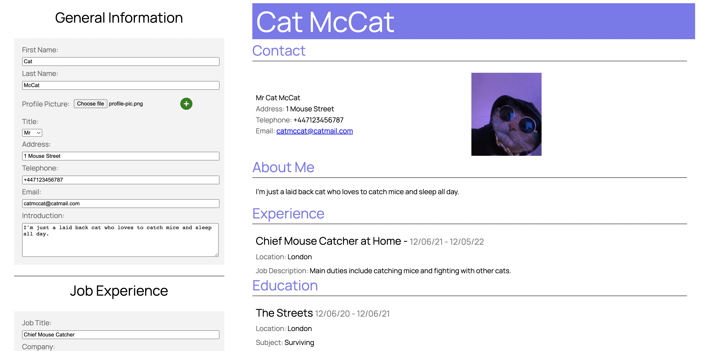

The brief of <a href="https://aaronkg1.github.io/cv-project/">this project</a> was to create a cv application using react class components. This was my first time building an App with React and as such, the code could definitely be refined. In the future, I will refactor the components to a cleaner functional style.

Initially I designed my child components so that they set the values from input fields into their own state, before passing back these values as arguments to the prop functions. This was causing bugs where the values inputted into the form were always one step behind those displayed on the page. I learnt that this was due to the asynchronicity of the code awaiting promise resolution. Directly passed the value of inputs from the child components into the parent props solved these issues.

**_ UPDATE _**

I refactored all modules into functional components using useState() React hooks. The program runs exactly the same however I feel like the functional syntax is easier to read (and more concise).
